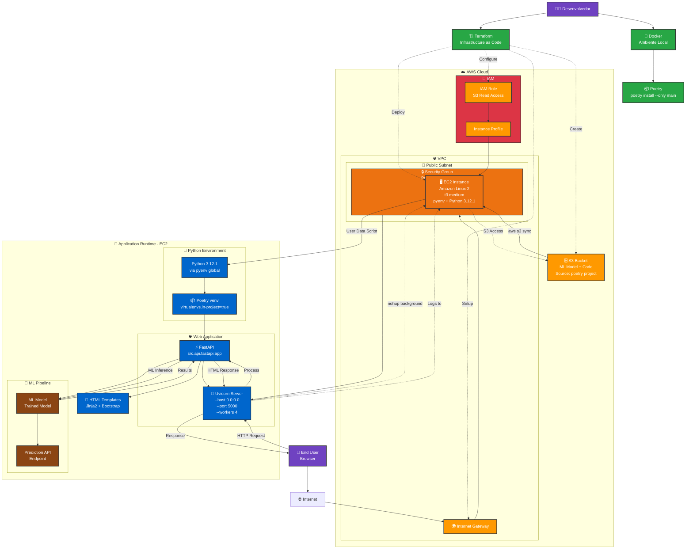

# Deploy ML Model in AWS

Este projeto implementa uma solução de infraestrutura em nuvem usando Terraform para hospedar uma aplicação de ciência de dados na AWS. A aplicação utiliza FastAPI para servir um modelo de machine learning treinado com scikit-learn.

## Arquitetura



### Componentes da Arquitetura

- **FastAPI**: API REST para servir o modelo ML
- **Uvicorn**: Servidor ASGI para Python
- **Terraform**: Infrastructure as Code (IaC)
- **Docker**: Containerização para desenvolvimento
- **AWS EC2**: Hospedagem da aplicação
- **AWS S3**: Armazenamento de código e artefatos
- **Poetry**: Gerenciamento de dependências Python

### Fluxo de Dados

1. **Desenvolvimento**: Desenvolvedor usa Docker + Poetry para ambiente local
2. **Deploy**: Terraform provisiona infraestrutura AWS (VPC, EC2, S3, IAM)
3. **Aplicação**: EC2 executa Python + FastAPI + Uvicorn servindo o modelo ML
4. **Acesso**: Usuários acessam via Internet → IGW → Security Group → EC2:5000

## Estrutura do Projeto

```
├── src/
│   ├── api/
│   │   └── fastapi.py          # API FastAPI principal
│   ├── ml/
│   │   ├── create_model.py     # Script de criação do modelo
│   │   └── trained_model.pkl   # Modelo treinado
│   └── templates/
│       └── index.html          # Template HTML
├── terraform/
│   ├── modules/
│   │   ├── api/                # Módulo EC2 e configuração da API
│   │   ├── ml_api_bucket/      # Módulo S3 bucket
│   │   └── vpc/                # Módulo VPC e rede
│   ├── main.tf                 # Configuração principal
│   ├── variables.tf            # Variáveis
│   ├── outputs.tf              # Outputs
│   └── terraform.tfvars        # Valores das variáveis
├── docker-compose.yml          # Orquestração do container de desenvolvimento
├── dockerfile                  # Imagem Docker para Terraform
├── pyproject.toml             # Configuração Poetry e dependências
└── .dockerignore              # Arquivos ignorados no build Docker
```

## Pré-requisitos

### Software Necessário
- [Docker](https://www.docker.com/get-started) (versão 20.10+)
- [Docker Compose](https://docs.docker.com/compose/install/) (versão 2.0+)

### Credenciais AWS
- Conta AWS ativa
- Access Key ID e Secret Access Key com permissões para:
  - EC2 (criar/gerenciar instâncias, security groups, key pairs)
  - S3 (criar/gerenciar buckets e objetos)
  - VPC (criar/gerenciar VPCs, subnets, internet gateways)
  - IAM (criar/gerenciar roles e policies)

### Configuração de Rede
- IPs autorizados para acesso à aplicação (configurados em `terraform.tfvars`)

## Configuração Inicial

### 1. Clone o Repositório
```bash
git clone https://github.com/JadesonBruno/di-deploy-ml-model-in-aws.git
cd di-deploy-ml-model-in-aws
```

### 2. Configure as Credenciais AWS
Crie um arquivo `.env` na raiz do projeto com suas credenciais AWS:

```bash
# .env
AWS_ACCESS_KEY_ID=sua_access_key_aqui
AWS_SECRET_ACCESS_KEY=sua_secret_key_aqui
AWS_DEFAULT_REGION=us-east-2
```

**⚠️ IMPORTANTE**: Nunca commite o arquivo `.env` no repositório. Ele já está incluído no `.gitignore`.

### 3. Ajuste as Variáveis do Terraform
Edite o arquivo `terraform/terraform.tfvars` com suas configurações:

```hcl
project_name = "deploy-ml-model"
environment = "dev"
aws_region = "us-east-2"
ami_id = "ami-0329ba0ced0243e2b"  # Amazon Linux 2 na região us-east-2
instance_type = "t2.micro"
vpc_cidr_block = "10.2.0.0/16"
allow_ips = [
    "SEU_IP/32",           # Substitua pelo seu IP público
    "OUTRO_IP/32"          # IPs autorizados para acesso
]
```

Para descobrir seu IP público: `curl ifconfig.me`

## Deploy da Solução

### 1. Navegue até a Raiz do Projeto
```bash
cd di-deploy-ml-model-in-aws
```

### 2. Construa e Execute o Container
```bash
docker-compose up -d --build
```

### 3. Acesse o Container
```bash
docker-compose exec terraform /bin/bash
```

### 4. Navegue até o Diretório Terraform
```bash
cd terraform/
```

### 5. Inicialize o Terraform
```bash
terraform init
```

### 6. Execute o Deploy
```bash
terraform apply
```

Digite `yes` quando solicitado para confirmar a criação dos recursos.

## Acesso à Aplicação

Após o deploy bem-sucedido, o Terraform exibirá os outputs:

```
Outputs:

ml_api_bucket_name = "deploy-ml-model-dev-ml-api-bucket-767397903600"
ml_api_public_dns = "ec2-xx-xxx-xxx-xxx.us-east-2.compute.amazonaws.com"
ssh_connection_command = "ssh -i \"deploy-ml-model-dev-ml-api-key.pem\" ec2-user@ec2-xx-xxx-xxx-xxx.us-east-2.compute.amazonaws.com"
```

### Acessar a API
- **URL da API**: `http://<ml_api_public_dns>:5000`
- **Documentação**: `http://<ml_api_public_dns>:5000/docs` (Swagger UI)

### Conectar via SSH
Use o comando fornecido no output `ssh_connection_command` para acessar a instância EC2.

## Estrutura da API

### Endpoints Principais
- `GET /`: Página inicial com interface HTML
- `POST /predict`: Endpoint para predições do modelo ML
- `GET /docs`: Documentação automática (Swagger UI)
- `GET /redoc`: Documentação alternativa (ReDoc)

### Exemplo de Uso
```bash
# Fazer uma predição
curl -X POST "http://<DNS_PUBLICO>:5000/predict" \
     -H "Content-Type: application/json" \
     -d '{"features": [1.0, 2.0, 3.0, 4.0]}'
```

## Desenvolvimento Local

### Usando Poetry
```bash
# Instalar dependências
poetry install

# Ativar ambiente virtual
poetry shell

# Executar a API localmente
poetry run uvicorn src.api.fastapi:app --reload --port 8000
```

### Usando Docker para Desenvolvimento
```bash
# Build da imagem
docker build -t deploy-ml-model-in-aws .

# Executar container
docker run -p 8000:8000 deploy-ml-model-in-aws
```

## Gerenciamento da Infraestrutura

### Visualizar Recursos
```bash
terraform show
```

### Verificar Estado
```bash
terraform state list
```

### Atualizar Infraestrutura
```bash
terraform plan
terraform apply
```

### Destruir Recursos
```bash
terraform destroy
```

**⚠️ CUIDADO**: Este comando remove todos os recursos criados na AWS.

## Monitoramento e Logs

### Logs da Aplicação
SSH na instância e execute:
```bash
tail -f /home/ec2-user/data-projects/di-deploy-ml-model-in-aws/uvicorn.log
```

### Logs de Inicialização
```bash
sudo tail -f /var/log/user-data.log
```

### Status do Servidor
```bash
ps aux | grep uvicorn
```

## Troubleshooting

### Problemas Comuns

1. **Erro de Credenciais AWS**
   - Verifique o arquivo `.env`
   - Confirme permissões IAM

2. **Timeout na Criação da Instância**
   - A instalação do Python pode demorar 15-20 minutos
   - Verifique os logs: `sudo tail -f /var/log/user-data.log`

3. **Erro "VpcLimitExceeded"**
   - Remova VPCs não utilizadas no console AWS
   - Ou solicite aumento de limite

4. **Erro "AddressLimitExceeded"**
   - Libere Elastic IPs não utilizados
   - Ou solicite aumento de limite

5. **API não responde**
   - Verifique se o Security Group permite tráfego na porta 5000
   - Confirme se o IP está na lista `allow_ips`

### Logs Úteis
```bash
# Container Terraform
docker-compose logs terraform

# Logs da instância EC2
ssh -i keys/deploy-ml-model-dev-ml-api-key.pem ec2-user@<IP>
sudo tail -f /var/log/user-data.log
tail -f /home/ec2-user/data-projects/di-deploy-ml-model-in-aws/uvicorn.log
```

## Segurança

### Boas Práticas Implementadas
- Instâncias em subnets públicas apenas para demonstração
- Security Groups com regras específicas
- IAM roles com permissões mínimas necessárias
- Chaves SSH geradas automaticamente
- Logs de auditoria habilitados

### Recomendações para Produção
- Usar subnets privadas para a aplicação
- Implementar Load Balancer
- Configurar Auto Scaling
- Usar RDS para banco de dados
- Implementar WAF
- Configurar CloudWatch para monitoramento
- Usar Secrets Manager para credenciais

## Contribuição

1. Fork o repositório
2. Crie uma branch para sua feature (`git checkout -b feature/nova-feature`)
3. Commit suas mudanças (`git commit -am 'Adiciona nova feature'`)
4. Push para a branch (`git push origin feature/nova-feature`)
5. Abra um Pull Request

## Licença

Este projeto está licenciado sob a Licença MIT - veja o arquivo [LICENSE](LICENSE) para detalhes.

## Autor

**Jadeson Bruno**
- Email: jadesonbruno.a@outlook.com
- GitHub: [@JadesonBruno](https://github.com/JadesonBruno)

## Tecnologias Utilizadas

- **Python 3.12**: Linguagem principal
- **FastAPI**: Framework web moderno e rápido
- **Uvicorn**: Servidor ASGI de alta performance
- **scikit-learn**: Biblioteca de machine learning
- **Terraform**: Infrastructure as Code
- **Docker**: Containerização
- **Poetry**: Gerenciamento de dependências Python
- **AWS**: Plataforma de nuvem (EC2, S3, VPC, IAM)
- **Amazon Linux 2**: Sistema operacional da instância

---

**Nota**: Este projeto foi desenvolvido para fins educacionais e demonstração de conceitos de MLOps e DevOps. Para uso em produção, considere implementar as recomendações de segurança mencionadas.
